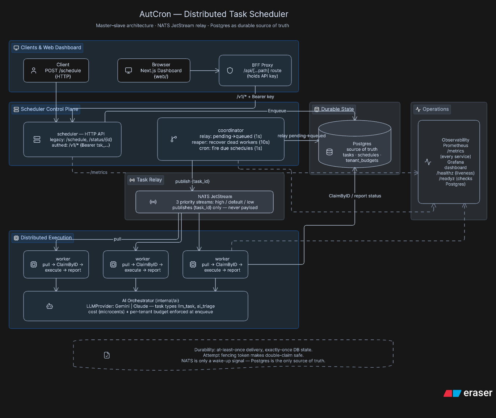

# AutCron



A distributed, durable task scheduler and autonomous AI orchestrator in Go.
Submit a task over HTTP, a coordinator relays it through NATS JetStream to a pool
of workers, and **Postgres is the durable source of truth** for every task's
state through crashes, retries, and worker failure -- proven under real process
kills, not just asserted. Recurring (cron) schedules, DAG task dependencies,
per-tenant API keys, a Next.js dashboard, and a provider-agnostic AI Orchestrator
layer (supporting Google Gemini and Anthropic Claude) build on top of that foundation.

## Architecture


```
                                                Postgres
                                          (tasks, schedules, source of truth)
                                                   ^  ^
                                                   |  |
client --HTTP--> scheduler --------- Enqueue ------+  |
                     |                                |
                     +-- /v1 JSON API (auth'd) --------+
                                                        |
                 coordinator: relay (pending->queued, 1s)
                              reaper (recovers dead workers/lost dispatches, 10s)
                              cron   (fires due schedules, 1s)
                                   |
                                   v  publish {task_id} only
                              NATS JetStream (3 priority-tier streams)
                                   |
                                   v  pull, one message per free goroutine
                              worker(s): ClaimByID -> execute -> report
```

- **scheduler** -- the HTTP API: the legacy `POST /schedule` /
  `GET /status/{id}` plus the authenticated `/v1/*` surface (tasks,
  schedules, workers, stats, an SSE stream, and optional AI endpoints).
- **coordinator** -- relays pending tasks onto NATS, runs the reaper that
  recovers abandoned or lost work, and fires due cron schedules. Executes
  nothing and decides no task's outcome -- workers own that entirely.
- **worker** -- pulls a task-id notification from NATS, claims it directly
  against Postgres, executes it via a registered handler, and reports its
  own terminal status. NATS's job ends the moment the claim resolves;
  Postgres, not the message, is what makes ownership exclusive.

**Postgres is the only source of truth.** NATS is a wake-up signal
carrying a task id -- never the payload, never the claim. If JetStream
loses a message outright, duplicates one, or goes down entirely, nothing
is lost: see [Recovery paths](#recovery-paths-and-their-timing).

## Quickstart

```
cp .env.example .env
make up          # postgres, nats, scheduler, coordinator, 3 workers
```

```
curl -XPOST localhost:18081/schedule \
  -d '{"task_type":"noop","payload":{"sleep_ms":500}}'
# => {"task_id":"...","created":true}

curl localhost:18081/status/<task_id>
```

Ports: scheduler `18081`, coordinator (metrics) `18082`, NATS `4222`
(monitoring `8222`), Postgres `5442`. Remap in `docker-compose.yml` if any
are taken locally.

### Authenticated API + dashboard

```
go run ./cmd/apikey -name "local dev"
# prints a tenant id (minted fresh) and a one-time api_key -- store it now

curl localhost:18081/v1/tasks \
  -H "Authorization: Bearer tsk_..."
```

```
cd web && cp .env.local.example .env.local   # set TASK_API_URL / TASK_API_KEY
npm install && npm run dev                    # http://localhost:3000
```

## Task types

Registered in `internal/task/handlers.go` (`noop`, `http_request`,
`shell`) and, when `ANTHROPIC_API_KEY` is set, `internal/ai` (`llm_task`,
`ai_triage`):

- `noop` -- `{"sleep_ms": 1000, "fail": false}`. Test workhorse.
- `http_request` -- `{"method","url","headers","body","expect_status"}`.
  Makes the scheduler usable as a webhook/callback runner.
- `shell` -- `{"argv": ["ls","-la"], "timeout_ms": 30000}`. Off by
  default; see [Security](#security).
- `llm_task` -- `{"model","system","prompt","max_tokens","effort","tenant_id"}`.
  Runs a Claude Opus 5 call, records token usage and cost on the task row,
  and enforces the tenant's monthly budget at enqueue time. See
  [AI features](#ai-features).
- `ai_triage` -- no payload; reads recent `dead_letter` tasks, clusters
  their `last_error` messages with Claude, and stores a summary in
  `triage_reports`. Point a cron schedule at it for a nightly digest.

Every payload may also carry a top-level `"timeout_ms"`, enforced
uniformly by the worker regardless of task type.

## The durability guarantee

**At-least-once delivery. Exactly-once database state. Not exactly-once
side effects.**

- An `idempotency_key` on submission dedupes at the database level: two
  clients submitting the same logical task produce one row. It does
  nothing about duplicate *execution* of that one row.
- Every claim carries an `attempt` fencing token (`attempts = attempts +
  1` at claim time, checked on every subsequent write). This guarantees
  exactly-once **bookkeeping**: at most one attempt can ever mark a given
  task `succeeded`. A worker whose lease already expired and was reclaimed
  by someone else has its terminal report silently discarded rather than
  corrupting the winning attempt's result.
- Duplicate **side effects** remain possible in exactly two windows, and
  no amount of Postgres logic eliminates them:
  1. A worker's lease expires while it is still alive and running (a long
     GC pause, clock skew, a handler that ran past its lease).
  2. A worker performs the side effect and then dies before it can report
     completion.
- **Therefore, handlers must be idempotent.** The task id is available to
  every handler via `task.TaskIDFromContext(ctx)` specifically so it can
  be used as a dedupe key against whatever the handler touches.

This is proven, not just asserted, by `test/chaos/chaos_test.go`:

- `TestChaos_WorkerKillsLoseNoTasks` submits 200 tasks whose handler
  writes to an append-only "attempts" ledger and then a primary-keyed
  "effects" table with no `ON CONFLICT`, `SIGKILL`s two of three workers
  mid-run, and asserts (a) all 200 effects are recorded exactly once, (b)
  the attempts ledger shows *more* than 200 attempts -- proof the kills
  actually interrupted in-flight work, not a no-op run -- and (c) at least
  one task was reclaimed and re-run, proving the fencing path was
  actually exercised.
- `TestChaos_GracefulDrainReleasesPromptly` proves the `SIGTERM` path is
  real, not just the lease backstop covering for it: in-flight tasks
  finish cleanly within the drain window, and untouched work is left
  exactly alone.

## Recovery paths and their timing

| Failure | Detected by | Recovery time |
|---|---|---|
| Worker dies mid-execution | Lease expiry (`lease_expires_at < now()`) | `TASK_LEASE_SECONDS` (default 300s), checked every 10s |
| A NATS message is lost, or a worker dies between fetch and claim | Queued-timeout reaper pass | `TASK_QUEUED_GRACE_SECONDS` (default 60s) |
| The coordinator's publish to NATS fails outright | Immediate, at publish | Next relay tick (~1s) |
| A dependency (DAG parent) permanently fails | `BlockOrphaned` reaper pass | Same 10s reaper tick |

The queued-timeout pass is the entire reason this design is safe with a
message broker in the loop at all: a lost, duplicated, or delayed NATS
message can never cause permanent task loss, only a bounded delay.
`ClaimByID`'s atomic `WHERE status='queued'` check is what makes it safe
for this reaper pass and a stale, still-in-flight redelivery to race --
whichever arrives second simply finds the row no longer claimable.

## Scheduling features

- **Cron schedules** (`internal/schedule`) -- `POST /v1/schedules` with a
  standard 5-field cron expression or `@daily`-style descriptor, an IANA
  timezone, and a `catchup_policy` (`skip` default, `one`, or `all`) for
  what happens after downtime. A partial unique index
  (`idx_one_active_run_per_schedule`) makes overlap prevention a database
  constraint, not application logic: a second concurrent run for the same
  schedule is a rejected insert, not a race to check-then-act.
- **Task dependencies** -- `tasks.depends_on UUID[]`, checked in the
  relay's eligibility query. `POST /v1/tasks/batch` resolves
  client-supplied local refs (`{"local_ref":"a"}`,
  `{"depends_on":["a"]}`) to real ids atomically. Deliberately not a full
  DAG engine: no cycle detection (a cycle just leaves its tasks pending
  forever -- observable, not prevented), no per-run identity, no reruns.
- **Concurrency caps** -- `task_type_limits(task_type, max_running)`,
  enforced in the same relay query via a `row_number()` window, so an
  over-limit task is never even published.
- **Priority** -- three NATS subject tiers (`high`/`default`/`low`,
  bucketed from a task's `priority` field) plus `ORDER BY priority DESC`
  in the relay. No weighted fair queuing; a saturated high tier can starve
  low, a known and undocumented-until-now ceiling.

## Multi-tenancy and auth

Deliberately light: a `tenant_id UUID` column (nullable -- unscoped rows
from the legacy `/schedule` path are not tenant-limited), and API keys as
the entire auth surface (`internal/auth`, `cmd/apikey`). No JWT: there is
no third-party identity provider to federate with. Keys are `sha256` +
`crypto/subtle` constant-time compare, generated with `crypto/rand`, rate
limited per key (`golang.org/x/time/rate`, 20 req/s burst 40) so a leaked
key can't flood the queue.

Every `/v1/*` route requires `Authorization: Bearer tsk_...`; the legacy
`/schedule` and `/status/{id}` remain unauthenticated for existing
integrations.

## Dashboard (`web/`)

Next.js + TypeScript, deployed **separately** from the Go backend. The
browser never talks to the Go API directly -- every request goes through
`web/app/api/[...path]/route.ts`, a backend-for-frontend proxy that holds
the API key server-side and forwards. This is not a style choice:

1. **CORS disappears** -- the browser only ever calls same-origin Next.js routes.
2. **The API key never reaches the browser.** A key in `NEXT_PUBLIC_*`
   would ship into the client bundle -- verified in CI-shape by grepping
   `.next/static` for the key after a production build; it must only
   appear in `.next/server`.
3. **`EventSource` cannot set an `Authorization` header** -- a hard
   browser limitation, not a config gap. Proxying through a same-origin,
   cookie-less route sidesteps it entirely for the live stats stream.

Stack: TanStack Query for all request/response state, native `EventSource`
for the one live stream (queue depth, throughput, p95 -- the stats panel,
not the task table: streaming table rows is how these dashboards turn
into unmaintainable state machines), Zod schemas validating every
response at the boundary, shadcn/ui + Recharts. See `web/README` files or
`.env.local.example` for setup.

## AI Orchestrator layer

`internal/ai` treats AutCron as **infrastructure for running LLM
workloads**, not a chatbot bolted onto a queue -- which is why every
durability feature above turns out to matter here specifically: LLM calls
are slow (async queue), fail with 429/503 as their normal failure mode
(retries with backoff), and cost real money per execution (idempotency,
budgets, dead-letter to stop a poison prompt burning budget in a loop).

The **Orchestrator layer** abstracts model providers behind a clean `LLMProvider`
interface, supporting **Google Gemini** (via `GEMINI_API_KEY`, defaulting to
`gemini-3.5-flash-lite` or `gemini-3.6-flash`) and **Anthropic Claude** (via
`ANTHROPIC_API_KEY`). If no key is set, AI routes return safe `501 Not Implemented`
and workers skip registering AI task types.

- **`llm_task`** -- Provider SDK retries are disabled to prevent silent,
  hidden retry loops inside workers. Instead, `internal/ai/errors.go` and
  provider error classifiers map responses: 400/404/Safety Refusal dead-letters
  immediately via `task.ErrPermanent` (retrying identical input can't help);
  429/503/5xx retry through the normal queue, honoring a `Retry-After` header
  exactly via `task.ErrRetryAfter` when present. The queue owns retries;
  the provider owns one attempt.
- **Cost accounting** -- token usage and cost land on the task row in
  integer microcents (never floats -- this is money). Per-tenant monthly
  budgets (`tenant_budgets`) are enforced at *enqueue*, not execution: a
  402 with nothing wasted beats discovering the tenant is over budget
  after a claim/dispatch/retry cycle already ran.
- **NL -> cron** (`POST /v1/schedules/suggest-cron`) -- constrained by
  strict tool use (`strict: true`, `additionalProperties: false`), then
  *independently* validated against the real cron parser before ever
  being returned. Cron is exactly the domain where a confidently wrong
  answer looks right; the model's output is never trusted on its own,
  and a failed validation retries once with the parse error fed back.
- **Dashboard NL search** (`POST /v1/tasks/search`) -- generates filter
  *parameters*, never SQL. `internal/ai/nlquery.go`'s column/operator
  allowlist is the actual security boundary, re-checked in Go after the
  model responds -- a JSON schema `enum` is a strong hint to the model,
  not a server-side guarantee. Text-to-SQL against a live database, fed
  by a model that may also read untrusted task payloads elsewhere in the
  system, is how a search box becomes a way to run arbitrary statements.
- **`ai_triage`** -- the scheduler scheduling analysis of its own failures
  is the dogfooding story: no separate pipeline, just another task type,
  clustering `dead_letter.last_error` messages into failure modes.

**Explicitly not done, on purpose:** no AI-chosen retry policies or
scheduling decisions -- nondeterminism in the durability path is precisely
backwards, since the entire value of the chaos-tested core above is that
recovery behavior is *provable*, and "the LLM probably retries sensibly"
is not a test. No agent loop -- every feature here is a bounded,
single-call, independently-verifiable transformation.

## Observability

`internal/metrics`: Prometheus on `/metrics` for every service (scheduler,
coordinator, each worker on `WORKER_HTTP_ADDR`), `structured log/slog`
throughout, `/healthz` (liveness only -- never checks dependencies, so a
Postgres blip doesn't make an orchestrator restart every instance at once)
and `/readyz` (checks Postgres, drains traffic instead). `docker-compose`
includes Prometheus + Grafana with a provisioned dashboard
(`deploy/grafana/dashboards/scheduler.json`) covering queue depth,
`tasks_dispatch_latency_seconds` (the scheduler's actual SLI: time from
`scheduled_at` to execution start), throughput, and reaper recoveries.

## Known limitations

- **Lease duration vs. task timeout.** A worker renews a running task's
  lease at `leaseDuration / 3`. If you lower `TASK_LEASE_SECONDS` well
  below a handler's realistic runtime, tasks can be reclaimed while still
  legitimately executing -- the duplicate-execution window described
  above, not a bug to "fix" by tightening timing further.
- **Worker pull loop probes tiers in strict order** (high, default, low)
  with a short `fetchWait` each. A long wait here directly taxes
  throughput whenever most traffic isn't on the highest tier -- which is
  the common case, since "default" is the default. Kept short (100ms) for
  exactly this reason.
- **`shell` tasks are remote code execution by design.** `POST /schedule`
  has no authentication; `/v1/tasks` does, but a leaked key still grants
  it. `ALLOW_SHELL_TASKS` defaults to `0`. When enabled, argv is executed
  directly via `exec.CommandContext` -- never through a shell -- so shell
  metacharacters in a single argument cannot be used for command
  injection; there is no sandboxing beyond that.
- **Cancelling a running task takes up to one lease-renewal interval**,
  not less -- there is no cheaper way to interrupt a goroutine already
  executing in another process. `POST /v1/tasks/{id}/cancel` on a
  `pending`/`queued` task is immediate; on `running` it sets a flag the
  lease renewer polls on its own cadence.
- **No cycle detection for task dependencies.** A cyclic `depends_on`
  leaves every task in the cycle `pending` forever -- observable (stuck,
  no status transition), not prevented.
- **Batch task submission has no per-item tenant scoping.** All items in
  one `POST /v1/tasks/batch` call share the submitting request's
  authentication context; there's no way to create a cross-tenant DAG,
  but there's also no per-item override.

## Development

```
make build              # go build ./...
make lint               # go vet + gofmt -l
make test               # unit tests, no database required
make test-integration   # starts postgres + nats, runs //go:build integration tests
make test-chaos         # starts postgres + nats, runs //go:build chaos tests (~3 min)
make web-install        # cd web && npm install
make web-dev            # cd web && npm run dev
```

Regenerating the gRPC-era proto is no longer applicable -- gRPC was
removed entirely in the move to NATS JetStream (`internal/queue`); the
coordinator-to-worker dispatch contract is now just `{task_id,
task_type}` over a NATS subject.

## Status

Ten phases, all implemented and tested: durable execution (leases,
fencing, retries, dead-lettering, graceful drain), NATS JetStream dispatch
(a net *deletion* of code versus the gRPC push it replaced -- no more
worker registry, no more heartbeats), Prometheus/Grafana observability,
cron schedules with catch-up policies, lightweight task DAGs, per-type
concurrency caps, API-key multi-tenancy, a separately-deployed Next.js
dashboard behind a BFF proxy, and Claude-powered task types with
queue-owned retries and per-tenant budgets. Every phase has unit tests
where the logic is pure (Go, no DB) and integration tests against real
Postgres/NATS where it isn't; the chaos tests are the headline proof for
the durability core specifically.
